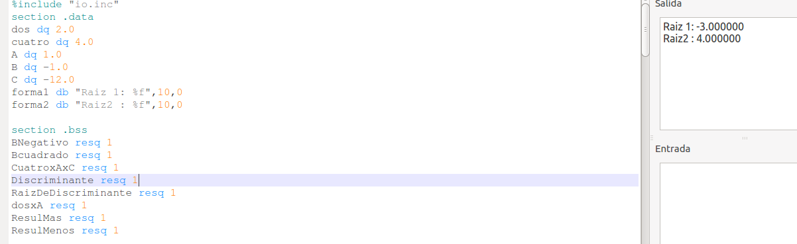
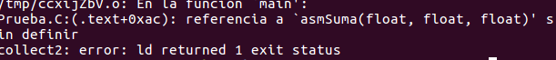

### Introduccion 
En este repositorio se mostrara como fue el paso a paso para resolver el TP1 de la materia de Organizacion del computador II. 

Este contiene:
- Formula resolvente con variables linkeadas entre codigo C y assembler.
- Ejercicios obligatorios de memoria y FPU.

# Formula Resolvente
Este equivale al punto 1 del TP , al encarar este ejercicio se presentaron muchas dudas de como encararlo , asique , decidi comenzar realizando un programa en 
assembler que con numeros ingresados manualmente , pueda realizar las operaciones de la fomula resolvente entendiendo que era escencial para continuar el ejercicio.

 
El segundo paso fue hacer un programa en c el cual pedia los 3 numeros al usuario y luego los cargaba en una funcion que se encargaria de linkearlos con el codigo assembler.

A este punto el ejercicio iba encaminado , hasta que llego el momento de linkear las variables que fue donde comenzaron los problemas.

El ejercicio que resolvia la formula lo hacia en la fpu , la idea fue separar la resolvente en pequeños calculos y e ir guardando esos resultados en variables que se utilizan para obtener el resultado final.

Al momento de linkear empiezo probando con enteros esto funciona correctamente , Pero al intentar linkear numero de punto flotanto a un programa pequeño de suma que sirvio como prueba aparece el primer error.

Este error todavia no enconre el porque sucedio solo se arreglo al copiar todo el archivo C en un nuevo archivo y ahi dfue que dejo crear el ejecutable.

